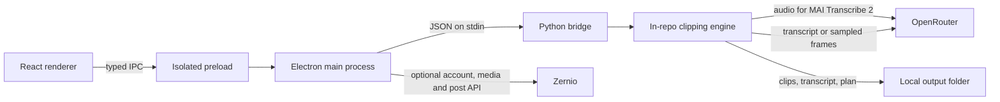

# Architecture and data flow

The renderer is sandboxed and cannot read saved provider keys. Main owns secure storage, validates IPC callers and job options, grants local media access through the native file picker, starts one worker job at a time, and checks the worker's JSON-line messages. A dropped local file opens that picker; its renderer-supplied path alone does not grant access. The bridge runs BridgeClip’s bundled Python engine in local mode and reserves stdout for progress and results. FFmpeg renders locally. A link is downloaded using the user's network connection into a temporary job workspace, which the engine removes after normal completion or failure; Electron also removes job work after the worker exits and sweeps stale work at startup. The original local source stays in place; finished clips, transcript, plan and result JSON persist in the output folder. Provider requests go directly to OpenRouter; when speech is unavailable, sampled frames replace transcript text for OpenRouter planning. Optional social-account management calls Zernio from main using the user's own Zernio key; browser sign-in returns through a one-time loopback callback. Posting also stays in main: it validates the selected clip and connected accounts, obtains a presigned media URL, uploads the clip, and sends the caption, targets and schedule to Zernio. Local post status, clip paths and titles, account handles, targets, links, and upload retry details are saved in the app data folder. On a Zernio key change, records from the previous workspace are hidden and quarantined on disk; a later cleanup can remove quarantine files after 30 days.

Saved run files are treated as untrusted input when loaded into the Library. The app shows sanitized diagnostics rather than raw provider or subprocess output. The Python bridge blocks private TCP destinations at connection time, including after URL redirects and DNS changes. Native or separate executable network clients need independent review before being added to the local pipeline.

The planned supported release builds are macOS Apple silicon and Intel. Windows source builds are experimental. The Python engine and its assets live in `engine/` in this repository; release builds package that source directly. No separate engine repository is needed.
